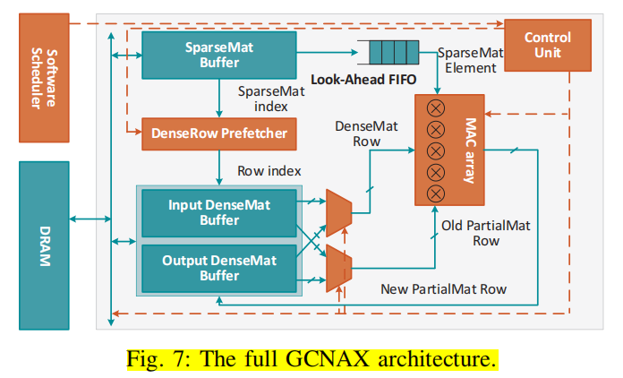
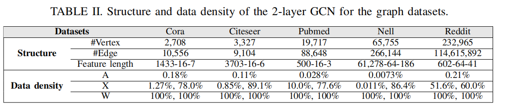
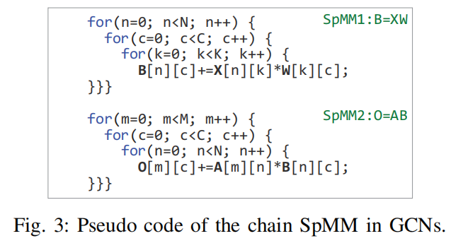
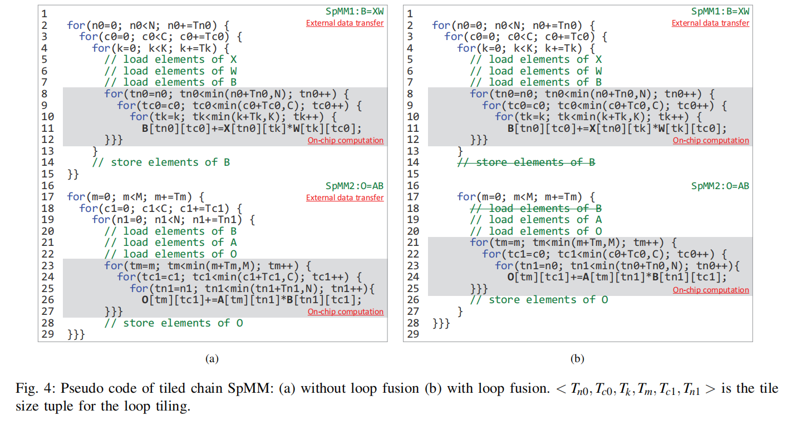
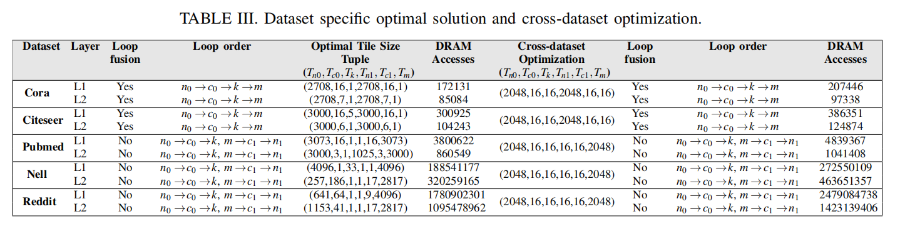
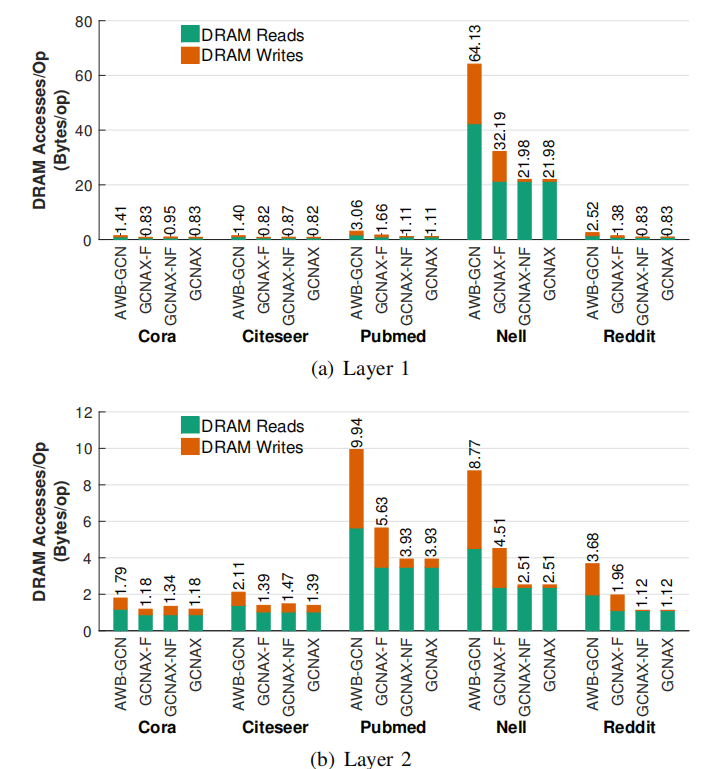

## GCNAX: A Flexible and Energy-effificient Accelerator for Graph Convolutional Neural Networks

You can click here to Open the [Original Paper](../Papers/HPCA'21_GCNAX.pdf),

### 一、文章定位

#### 将GCN的阶段均抽象为矩阵乘法，引入Loop Tiling，Loop Fusion以及Loop interchange等循环优化技术，提供灵活的优化数据流进而提高资源利用率并且减少数据移动的开销。

### 二、文章总体架构：

### 三、文章的数据集信息：

### 四、文章的Motivation：（Combination-first范式）

#### 其所对标的文章MICRO'20_AWB-GCN虽然加速了GCNs以及Sparse-dense Matrix Multiplication (SpMM) kernels，并且在一些真实世界图当中一定程度解决了workload imblance问题，但是loop optimization技术并未仔细地定制（Carefully tailored）到GCN地处理过程当中。这带来了很多的冗余数据存储，因此文章从Loop optimization地角度出发进行细粒度地优化。

### 五、文章的核心工作思路：

#### 总结而言，基于原始范式矩阵乘法范式，采用2D-tiling思想引入三种Loop optimization技术进行细粒度的优化

#### 一般地Combination First计算范式：（不考虑Tiling）

#### 下图(a)为引入loop-tiling地矩阵乘法伪代码，(b)是在(a)基础上引入Loop Fusion的矩阵乘法伪代码

#### 下图为引入loop interchange的多种搭配

### 六、实验结果：

#### 

#### 相较于HyGCN以及AWB-GCN获得了总结而言GCNAX相较于HyGCN以及AWB-GCN平均取得8.9x以及1.6x的speedup，8.1x以及2.4x的DRAM access reduction, 9.5x以及2.3x的energy savings。

### 七、文章的问题，见([HPCA'23_GROW.md](./Articles/Reading_Report/HPCA'23_GROW.md))

