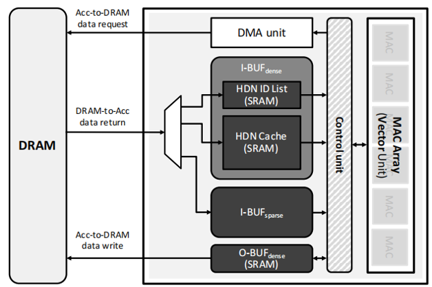
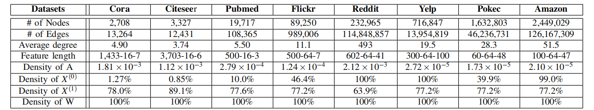
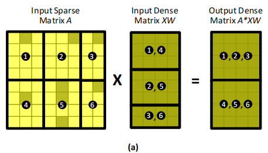
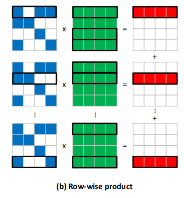
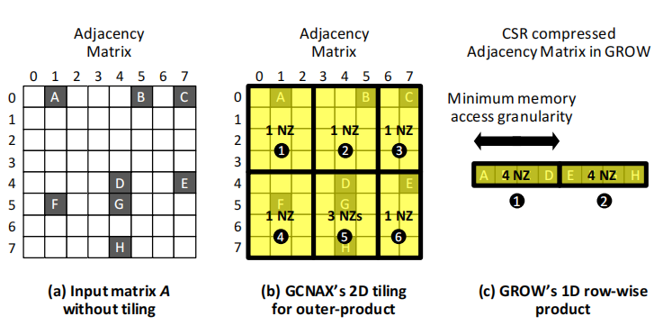
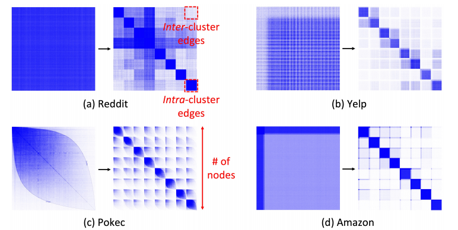
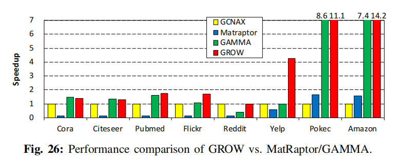
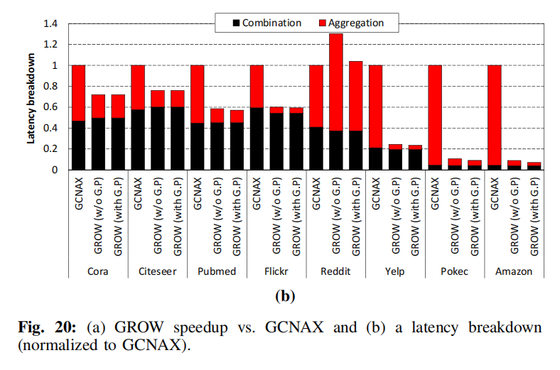
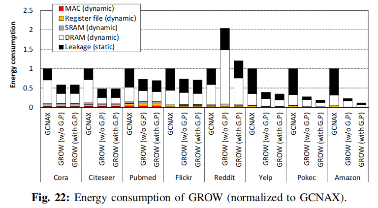
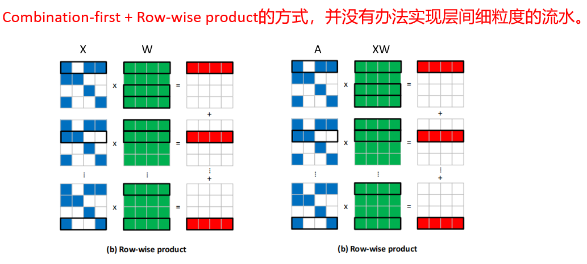

## GROW: A Row-Stationary Sparse-Dense GEMM Accelerator for Memory-Effificient Graph Convolutional Neural Networks

You can click here to Open the [Original Paper](../Papers/HPCA'23_GROW.pdf).

### 一、文章定位

#### 基于**Gustavson’s algorithm**算法（本质上就是Row-wise product）构建的采用Sparse-Dense General Matrix Multiplication 计算范式的GCN加速器，文章主要从减少频繁的无效数据移动角度出发，优化前面的SOTA加速器HPCA’21_GCNAX。

### 二、文章总体架构：

### 三、文章的数据集信息：

### 四、文章的Motivation：（Combination-first范式）

### 针对前面的SOTA GCN加速器HPCA'21_GCNAX的问题：

#### **1、如下图(a)所示：采用固定的2D-rigid-Tile方式，由于A矩阵及其稀疏，对于这三个数据集Yelp/Pokec/Amazon而言，80%的tile中只有不超过2个非零元素，然而A矩阵本身是存储在片外，由于DRAM的访存粒度在64B（猝发传输方式），这会导致，从片外DRAM取数据往往只有少数的数据在当前tile（例如当前的tile①）里面，剩余的数据都是其他的tile当中（例如其后的tile②③④等），造成了无效的数据存取，带来带宽浪费。**

#### 2、由于GCNAX并未考虑XW与AX两个阶段的左乘矩阵的稀疏特性，而是默认X是大而稀疏。这在如下情况时会导致Overprovision情况出现：在Combination过程中，此时的X在Reddit/Yelp/Amazon三个大数据集上均为密集，最差情况下的tile-size也是完全密集，这需要有很大的on-chip buffer来存放从片外读取的X的当前tile数据；但在随后的Aggregation阶段由于A的稀疏极高，所需要的on-chip buffer大小（此时从片外读取A矩阵）远远小于Combination阶段对X的需求，这就势必对已经配置好的on-chip buffer(SRAM资源)造成浪费，也就是所谓的on-chip buffer Overprovision问题。

#### 由于这两个问题GCNAX的方案必然是Suboptimal。

### 五、文章的核心工作思路：

- #### 1、总体采用Combination-first，Row-wise product计算范式，放弃了GCNAX的2D-tiling方案，而是采用1D Row-wise product tiling方案。如果不对图进行重排，这种方案最大的问题在于Aggregation时对于XW矩阵的随机访存。为了解决这个问题，采用下面2中的重排方式进行优化。

- #### 2、利用Metis图分区策略对原始图进行分区（本质上就是节点ID自同构映射），将Top-N HDN策略用在每一个对角线的Clusters内部而非整个邻接矩阵上。（好处和原因是：①HDN Cache空间有限，图规模较大时top-N节点数很多，Cache放不下；②提升了Clusters内部的Cache命中率。）

### 六、实验结果：

注：图中GAMMA(ASPLOS‘21)，MapRaptor(MICRO'20)均为通用Sparse Matrix Multiplication文章。

#### 总结而言：GROW相较于GCNAX平均取得2x DRAM traffic reduction(Max 4.7x), 2.8x Speedup(Max 14.2x)以及 2.3x energy-efficiency。

### 七、文章存在的优化空间

