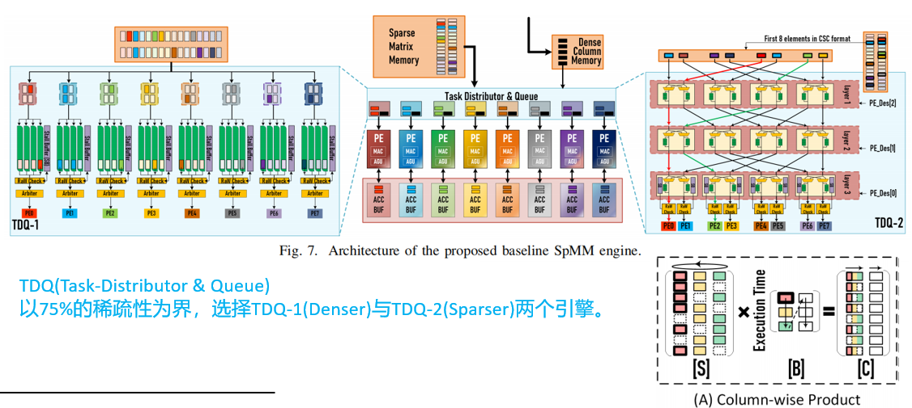
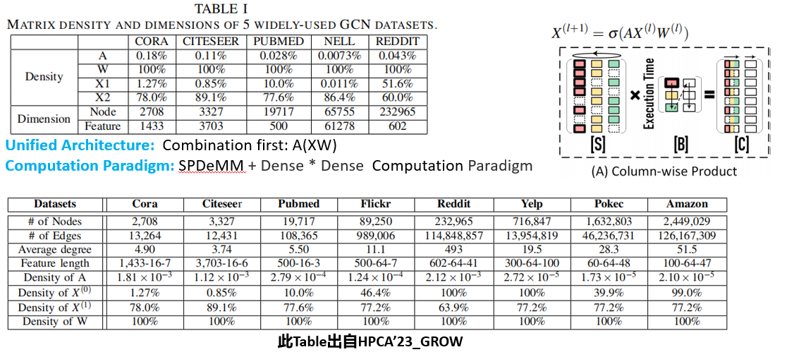
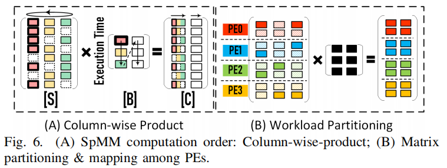
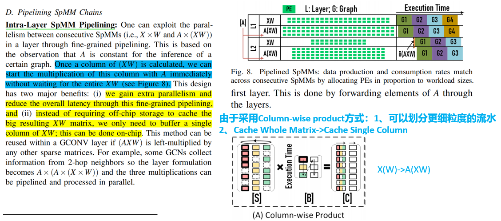
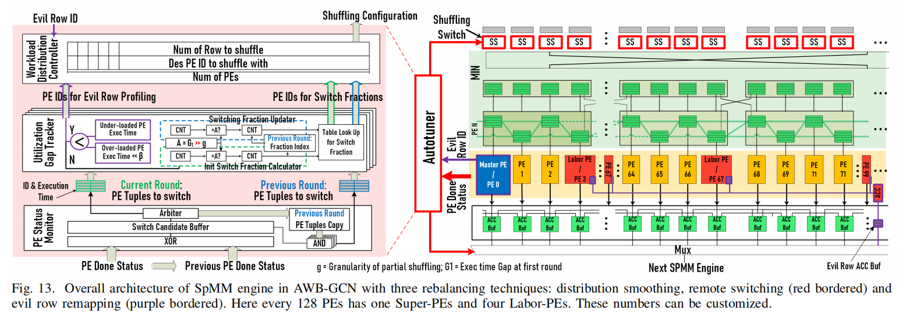
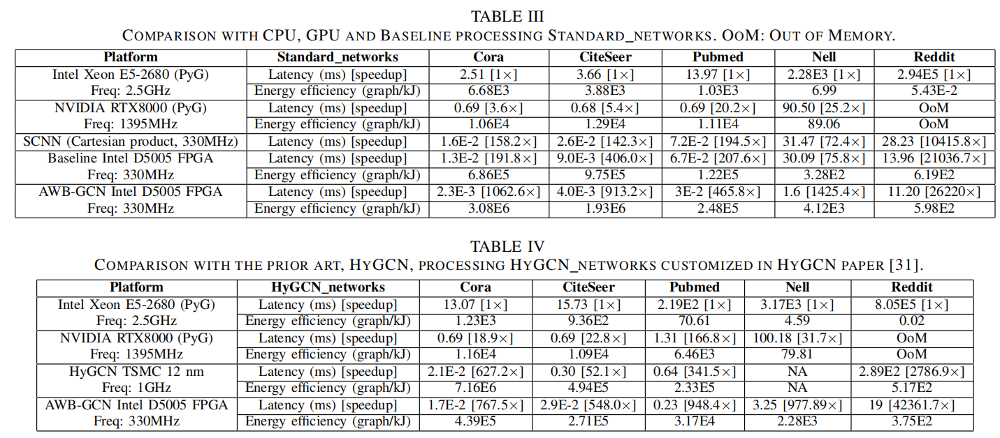
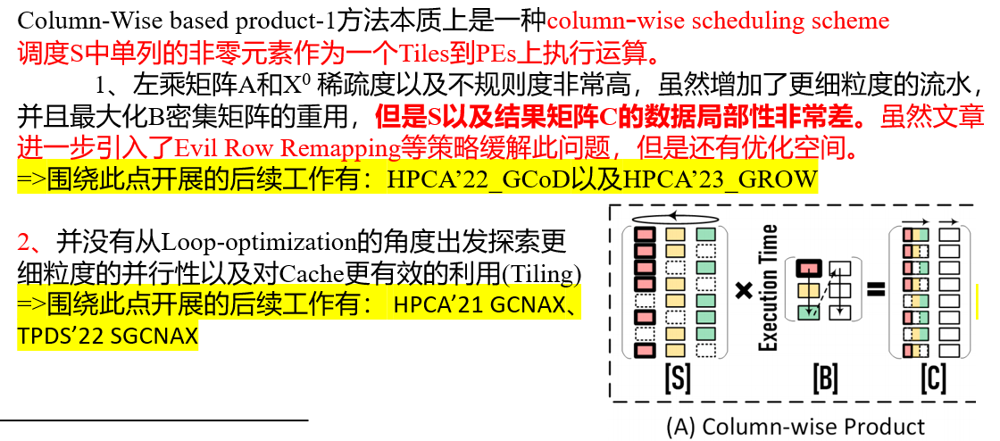

## AWB-GCN: A Graph Convolutional Network Accelerator with Runtime Workload Rebalancing

You can click here to Open the [Original Paper](../Papers/MICRO'20_AWB_GCN.pdf).

### 一、文章定位

#### 采用Column-wise product计算范式的文章，实现了层间细粒度的流水。

### 二、文章总体架构：

#### 分成两种计算引擎：Denser以及Sparser，根据稀疏度划分选择具体采用哪种引擎。

### 三、文章的数据集信息：

### 四、文章的Motivation：（Combination-first范式）

#### 指出图的Power-Law Distribution问题，分析采用combination-first范式将比Aggregation-first范式更节省计算以及内存读取。

### 五、文章的核心工作思路：

#### 文章总体采用Column-wise product计算范式，如下图所示：

#### 其中层间采用细粒度的流水实现：

#### 文章为了解决PE的负载不均衡问题，采用Evil-row Remapping、Distribution Smoothing、以及Remote Switching等技术进行运行动态优化。

### 六、实验结果：

#### 总结而言：AWB-GCN相较于HyGCN平均取得3.4x DRAM traffic reduction, 7.4x Speedup(Max 14.2x)以及 4.1x energy-efficiency。

### 七、文章存在的优化空间

