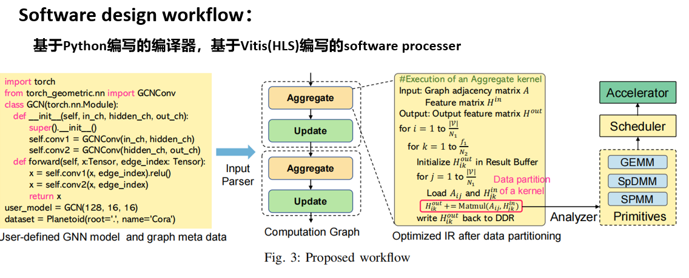

### Article List：

* [1、Arxiv'23 GNNbuilder A Graph Convolutional Network Accelerator with Runtime Workload Rebalancing](#1arxiv23-gnnbuilder-a-graph-convolutional-network-accelerator-with-runtime-workload-rebalancing)
* [2、Arxiv'23 Dynasparse Accelerating GNN Inference through Dynamic Sparsity Exploitation](#2arxiv23-dynasparse-accelerating-gnn-inference-through-dynamic-sparsity-exploitation)

####  1、[**Arxiv'23**]  GNNbuilder-A Graph Convolutional Network Accelerator with Runtime Workload Rebalancing

>*Author: Tong Geng, Ang Li, et, al.* 	*Institute: Boston University*

#### ——文章定位：第一个自动化的、通用的、端到端的GNN加速器生成框架。

#### (自动化体现在从Pytorch(Python)->HLS代码->RTL)

**已开源**: https://anonymous.4open.science/r/gnn-builder-83B4/

#### 2、[**Arxiv'23**] Dynasparse-Accelerating GNN Inference through Dynamic Sparsity Exploitation

>*Author: Bingyi Zhang, Viktor Prasanna, et, al.* 	*Institute: UCLA* 

#### 文章核心：在预先不知道输入数据的稀疏性的情况下，通过建模计算选择出最优的计算原语(包括GEMM、SpDMM以及SPMM)和任务调度策略来加速通用的GNN inference过程。

##### 突出两点通用性：对于不同数据集的通用性 + 对于GNN模型的通用性

#### 软件栈：

#### 硬件设计：（包括三种计算模式，采用GCN相关加速器的设计。）

